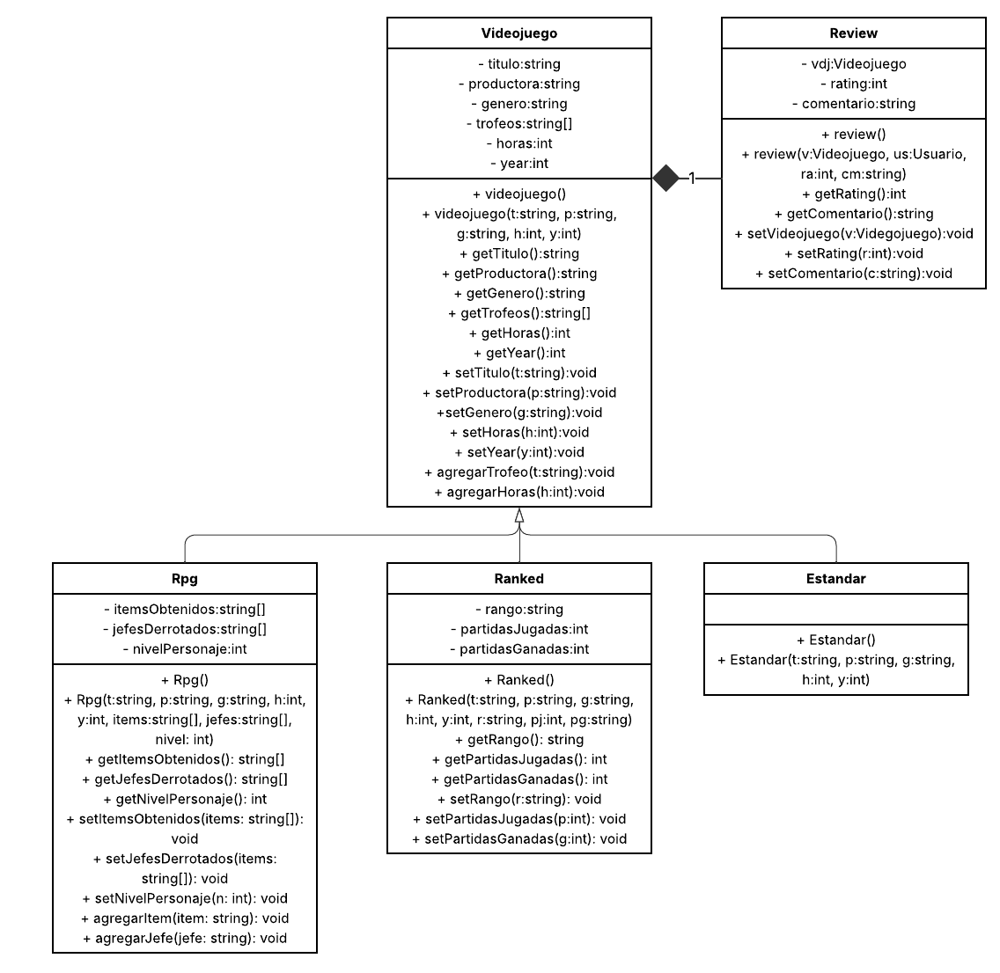

# GameLog
## Contexto
Pensamiento computacional a objetos. TC1033.301 Proyecto
GameLog es un programa inspirado en plataformas de seguimiento de medios (como Letterboxd), pero enfocado exclusivamente en videojuegos. Su funcionalidad central es permitir al usuario almacenar, consultar y actualizar información sobre los videojuegos que ha jugado, junto con una reseña personal para cada uno.
## Funcionalidad
El programa soporta tres tipos de videojuegos:
1. RPG
2. Competitivo (Ranked)
3. Estándar / Otros

Cada videojuego contiene información como:
1. Título
2. Productora
3. Género
4. Año de lanzamiento
5. Horas jugadas
6. Trofeos (lista)
7. Reseña (rating del 0 al 10 y comentario)

Además, cada categoría incluye atributos específicos:

1. RPG: nivel del personaje, items obtenidos y jefes derrotados
2. Ranked: partidas jugadas y partidas ganadas
3. Estándar: atributos básicos sin información adicional

El usuario puede:

1. Agregar videojuegos nuevos
2. Ver la lista completa de juegos por tipo
3. Consultar los detalles individuales de un videojuego
4. Modificar reseñas
5. Editar datos específicos de cada videojuego

## Diagrama de clases

## Compilación e instalación
El programa solo corre en la consola y esta hecho con c++ standard por lo que corre en todos los sistemas operativos

## Linux
Compilación: `g++ main.cpp -o GameLog`

Ejecución: `./GameLog`

## Windows

Compilación: `g++ main.cpp -o GameLog.exe`

Ejecución: `./GameLog.exe`

## Correcciones
En este programa se hicieron las siguientes correcciones:
1. Corregí el uso de composición en mi código (de reseña como atributo en videojuego)
2. Se corrigió el UML
3. Se agrego un readme mejor hecho
4. Se agregaron comentarios y reglas de estilo a los códigos
